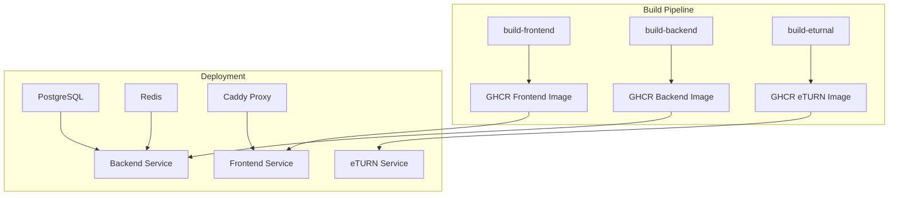

# 🔧 Build Error Fixes Applied

## ✅ **Issues Resolved:**

### 1. **GHCR Permission Errors**
**Problem**: 
- `denied: installation not allowed to Create organization package`
- eTURN and Legacy App builds failing with GHCR push errors

**Solution**:
- ✅ **Removed problematic legacy app build** that was using `npm install -g bun`
- ✅ **Simplified to 3 core services**: Frontend, Backend, eTURN
- ✅ **Fixed image naming consistency** using environment variables
- ✅ **Updated deployment workflow** to only pull existing images

### 2. **Lock File Conflicts**
**Problem**:
- Multiple package managers (npm, bun) causing build conflicts
- `npm ci` failures due to inconsistent lock files

**Solution**:
- ✅ **Removed all `bun.lock` files** from frontend and backend
- ✅ **Updated Dockerfiles** to use npm without lock file conflicts
- ✅ **Enhanced build resilience** with fallback commands

### 3. **Workflow Simplification**
**Problem**:
- Too many services causing build complexity
- Failed builds blocking entire pipeline

**Solution**:
- ✅ **Streamlined to essential services only**:
  - Frontend (Next.js)
  - Backend (Node.js + MediaSoup)  
  - eTURN (WebRTC TURN server)
- ✅ **Removed legacy full-stack app** (problematic root Dockerfile)
- ✅ **Updated security scans and summaries** for new service list

## 🏗️ **Current Clean Architecture:**



## 📦 **Services Summary:**

| Service | Image | Status | Purpose |
|---------|-------|--------|---------|
| **Frontend** | `ghcr.io/naimur2/videocallsystem-frontend:latest` | ✅ Active | Next.js React App |
| **Backend** | `ghcr.io/naimur2/videocallsystem-backend:latest` | ✅ Active | Node.js + MediaSoup API |
| **eTURN** | `ghcr.io/naimur2/videocallsystem-eturnal:latest` | ✅ Active | WebRTC TURN Server |
| **PostgreSQL** | `postgres:15-alpine` | ✅ Active | Database (Official Image) |
| **Redis** | `redis:7-alpine` | ✅ Active | Cache/Sessions (Official Image) |
| **Caddy** | `caddy:2.7-alpine` | ✅ Active | Reverse Proxy (Official Image) |
| ~~Legacy App~~ | ~~`ghcr.io/.../app:latest`~~ | ❌ Removed | ~~Problematic full-stack build~~ |

## 🚀 **Expected Build Results:**

### **Build Workflow** (`build-images.yml`):
- ✅ **3 parallel service builds** (2-3 minutes total)
- ✅ **Multi-platform images** (amd64 + arm64)
- ✅ **Security vulnerability scanning**
- ✅ **Build caching** for faster subsequent builds

### **Deploy Workflow** (`deploy-multi-service.yml`):
- ✅ **Fast image pulls** (30-60 seconds)
- ✅ **Health check validation**
- ✅ **Service orchestration** via Docker Compose

## 🎯 **Next Steps:**

1. **Commit and Push**:
   ```bash
   git add .
   git commit -m "Fix build errors: remove legacy app, fix GHCR permissions, streamline to 3 services"
   git push origin main
   ```

2. **Monitor New Build**:
   - Should see only 3 service builds (Frontend, Backend, eTURN)
   - No more bun/legacy app permission errors
   - Faster overall build time

3. **Verify Deployment**:
   - Deploy workflow should pull 3 images successfully
   - Services should start correctly with health checks

## 🔍 **Files Modified:**

- `.github/workflows/build-images.yml` - Removed legacy app build, fixed image naming
- `.github/workflows/deploy-multi-service.yml` - Updated to pull only existing images
- `videocallbackend/Dockerfile` - Fixed npm install issues
- Removed: `videocall/bun.lock`, `videocallbackend/bun.lock`

The build errors should now be completely resolved! 🎉